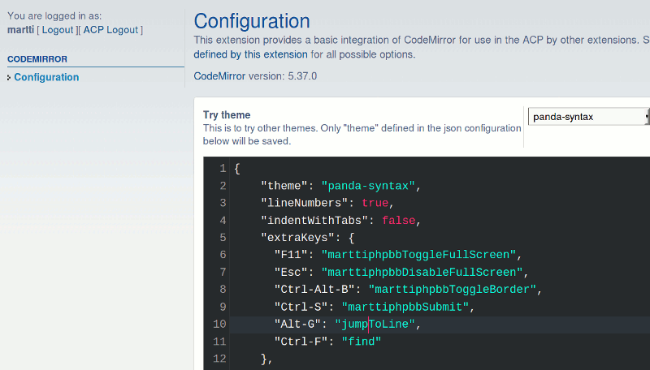

# PhpBB Extension - marttiphpbb CodeMirror (helper ext)

## Requirements

phpBB 3.2+ PHP 7+

## Features

This phpBB extension provides a basic integration of the [CodeMirror](http://codemirror.net) code editor for use in the ACP by other extensions. See [CodeMirror configuration](http://codemirror.net/doc/manual.html#config) for the possible options and commands.
The extension tries to load all required dependencies by inspecting a configuration set in JSON format.

## Screenshot

## Extra Options and Commands

This extension provides some extra configuration options and commands. All of them are prefixed with "marttiphpbb".

### Border

To provide a border around the CodeMirror editor. Helpful for the light themes against the light background of the ACP.

#### Options

* `marttiphpbbBorderEnabled`: defaults to `false`.
* `marttiphpbbBorderStyle`: defaults to `1px solid lightgrey`

#### Commands

* `marttiphpbbToggleBorder`
* `marttiphpbbEnableBorder`
* `marttiphpbbDisableBorder`

### Full screen

Commands for the CodeMirror "fullScreen" option:

* marttiphpbbToggleFullScreen
* marttiphpbbDisableFullScreen
* marttiphpbbEnableFullScreen

### Submit

This command generates a click event on submit buttons:

* marttiphpbbSubmit

## Limitations

* Configuration is in JSON, so no functions can be defined.
* Not all configuration options are working (yet).
* Only one editor can be loaded in one page (for now).

## Quick Install

You can install this on the latest release of phpBB 3.2 by following the steps below:

* Create `marttiphpbb/codemirror` in the `ext` directory.
* Download and unpack the repository into `ext/marttiphpbb/codemirror`
* Enable `CodeMirror (helper ext)` in the ACP at `Customise -> Manage extensions`.
* You can start editing the CodeMirror in the Forum ACP for each Forum.

## Uninstall

* Disable `CodeMirror (helper ext)` in the ACP at `Customise -> Extension Management -> Extensions`.
* To permanently uninstall, click `Delete Data`. Optionally delete the `/ext/marttiphpbb/codemirror` directory.

## Support

* Report bugs and other issues to the [Issue Tracker](https://github.com/marttiphpbb/phpbb-ext-codemirror/issues).

## License

[GPL-2.0](license.txt)

([CodeMirror](http://codemirror.net) is licensed under MIT.)

